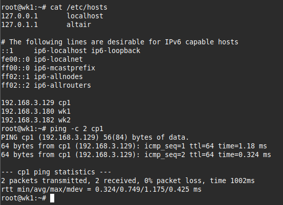
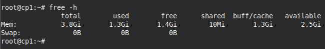
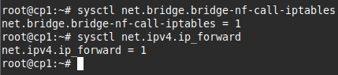
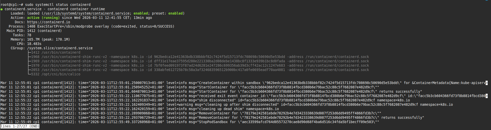

# Environment Setup

This section covers the base configuration that must be applied to every node before installing Kubernetes or K3s. Complete every step in order. Do not skip any step, even if it seems optional.

---

## Lab Environment

| Role | Hostname | IP Address | OS |
|---|---|---|---|
| K8s Control Plane | cp1 | 192.168.3.129 | Linux Mint 22 |
| K3s Server | k3s-server | 192.168.3.184 | Linux Mint 22 |
| K3s Agent 1 | k3s-agent-1 | 192.168.3.185 | Linux Mint 22 |
| K3s Agent 2 | k3s-agent-2 | 192.168.3.186 | Linux Mint 22 |

> Adjust IPs to match your own machines. The important thing is that all nodes can reach each other by IP.

---

## Step 1 - Update the System

Run on every node.

```bash
sudo apt update && sudo apt upgrade -y
```

---

## Step 2 - Install Required Packages

```bash
sudo apt install -y \
  curl wget git \
  apt-transport-https \
  ca-certificates \
  gnupg lsb-release \
  net-tools
```

---

## Step 3 - Set the Hostname

Each node needs a unique hostname. Run the command that matches the node you are on.

```bash
# On the K8s control plane node
sudo hostnamectl set-hostname cp1

# On the K3s server node
sudo hostnamectl set-hostname k3s-server

# On K3s agent 1
sudo hostnamectl set-hostname k3s-agent-1

# On K3s agent 2
sudo hostnamectl set-hostname k3s-agent-2
```

Start a new shell session so the hostname takes effect:

```bash
exec bash
```

---

## Step 4 - Configure /etc/hosts

Every node needs to be able to resolve the other nodes by hostname. Add the following to `/etc/hosts` on every node.

```bash
sudo nano /etc/hosts
```

Add these lines at the bottom:

```
192.168.3.129   cp1
192.168.3.184   k3s-server
192.168.3.185   k3s-agent-1
192.168.3.186   k3s-agent-2
```

Test resolution:

```bash
ping -c 2 cp1
ping -c 2 k3s-server
```



---

## Step 5 - Disable Swap

Kubernetes requires swap to be disabled. K3s does not require this but it is good practice.

```bash
# Disable immediately
sudo swapoff -a

# Disable permanently across reboots
sudo sed -i '/ swap / s/^/#/' /etc/fstab
```

Verify swap is off:

```bash
free -h
```

The Swap line should show `0B` across all columns.



---

## Step 6 - Load Kernel Modules

```bash
sudo modprobe overlay
sudo modprobe br_netfilter

cat <<EOF | sudo tee /etc/modules-load.d/k8s.conf
overlay
br_netfilter
EOF
```

---

## Step 7 - Configure Kernel Networking Parameters

```bash
cat <<EOF | sudo tee /etc/sysctl.d/k8s.conf
net.bridge.bridge-nf-call-iptables  = 1
net.bridge.bridge-nf-call-ip6tables = 1
net.ipv4.ip_forward                 = 1
EOF

sudo sysctl --system
```

Verify both values are active:

```bash
sysctl net.bridge.bridge-nf-call-iptables
sysctl net.ipv4.ip_forward
# Both must return = 1
```



---

## Step 8 - Install the Container Runtime

Both K8s and K3s need a container runtime. We use `docker.io` because it ships with containerd, which is the actual runtime Kubernetes talks to, while also giving you the Docker CLI for image inspection.

```bash
sudo apt install -y docker.io docker-compose
```

Configure containerd to use the systemd cgroup driver. This is required for kubeadm:

```bash
sudo mkdir -p /etc/containerd
containerd config default | sudo tee /etc/containerd/config.toml

sudo sed -i 's/SystemdCgroup = false/SystemdCgroup = true/' \
  /etc/containerd/config.toml

sudo systemctl restart containerd
sudo systemctl enable containerd
```

Verify containerd is running:

```bash
sudo systemctl status containerd
```



Fix the crictl endpoint warning that appears by default:

```bash
sudo crictl config \
  --set runtime-endpoint=unix:///run/containerd/containerd.sock \
  --set image-endpoint=unix:///run/containerd/containerd.sock
```

---

## Verification Checklist

Before moving to any installation guide, confirm the following on every node:

| Check | Command | Expected Result |
|---|---|---|
| Swap off | `free -h` | Swap row shows 0B |
| ip_forward on | `sysctl net.ipv4.ip_forward` | = 1 |
| containerd running | `systemctl status containerd` | active (running) |
| Hostname set | `hostname` | correct hostname |
| Nodes reachable | `ping -c 1 <other-node>` | 0% packet loss |
